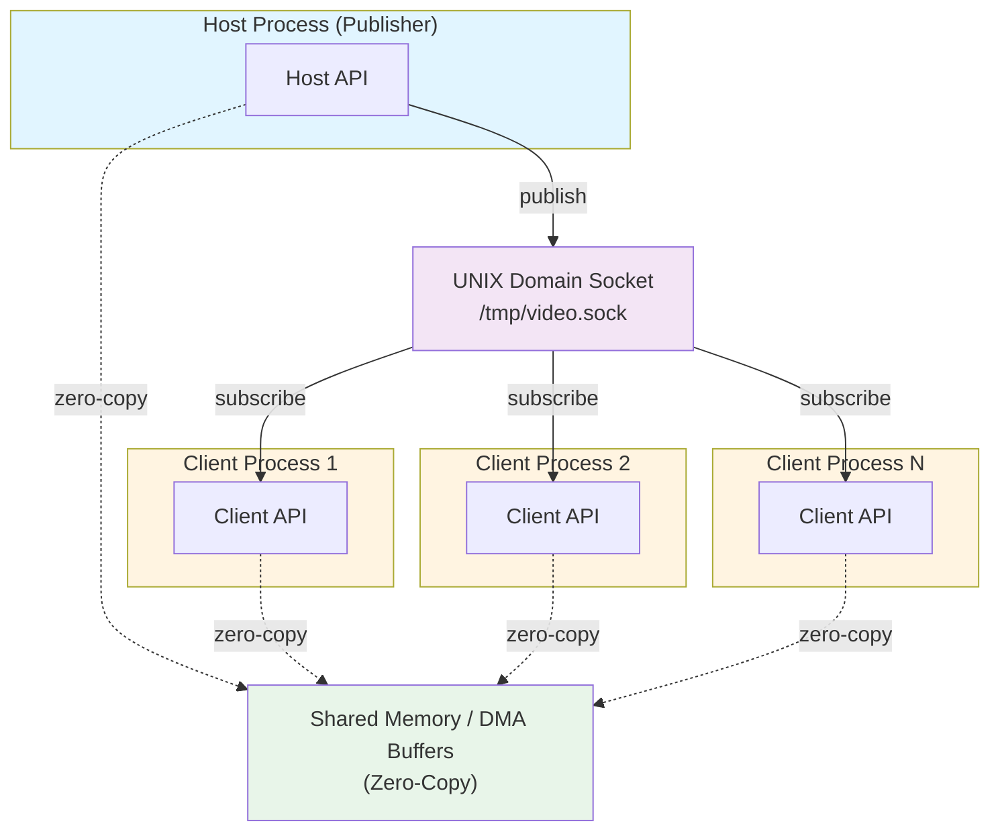

# videostream-rs

[](https://github.com/EdgeFirstAI/videostream-rs/actions)
[](https://opensource.org/licenses/Apache-2.0)
[](https://crates.io/crates/videostream)
[](https://docs.rs/videostream)

Safe Rust bindings for the VideoStream Library - enabling zero-copy video frame management and distribution across processes and containers.

## Overview

`videostream-rs` provides a safe, idiomatic Rust API for the [VideoStream Library](https://github.com/EdgeFirstAI/videostream), a high-performance video frame sharing system designed for edge AI and computer vision applications on resource-constrained embedded devices.

### Key Features

- **Zero-Copy Frame Sharing** - Share video frames across process boundaries without memory copies
- **DMA Buffer Support** - Hardware-accelerated memory access for GPUs and NPUs
- **Hardware Video Codecs** - Accelerated H.264/H.265 encoding and decoding
- **V4L2 Camera Capture** - Direct camera integration with zero-copy buffers
- **Process Isolation** - Secure frame distribution via UNIX domain sockets
- **Multi-Subscriber** - Single publisher, multiple subscribers pattern
- **Rust Safety** - Memory-safe abstractions over native C library

### Use Cases

- Edge AI inference pipelines (frame capture → processing → display)
- Video streaming and recording on embedded devices
- Multi-process computer vision applications
- Container-based video processing (Docker, LXC)
- Hardware-accelerated video transcoding

## Installation

Add `videostream` to your `Cargo.toml`:

```toml
[dependencies]
videostream = "0.1"
```

### Prerequisites

The VideoStream Library (libvideostream) must be installed on your system:

**Version Required:** 1.3.9 or newer

**Installation:** See the [VideoStream Library documentation](https://github.com/EdgeFirstAI/videostream) for installation instructions.

## Quick Start

### Publishing Frames (Host)

A **Host** publishes video frames to subscribers via a UNIX domain socket.

```rust
use videostream::{Host, Frame};

fn main() -> Result<(), Box<dyn std::error::Error>> {
    // Create a host that listens on a socket
    let host = Host::new("/tmp/camera.sock")?;

    // Allocate a frame buffer
    let mut frame = host.allocate_frame(1920, 1080, fourcc::YUV420)?;

    // Populate frame data (e.g., from camera)
    populate_frame_data(&mut frame);

    // Publish to all subscribers
    host.publish(frame)?;

    Ok(())
}
```

### Subscribing to Frames (Client)

A **Client** subscribes to frames from a Host.

```rust
use videostream::Client;

fn main() -> Result<(), Box<dyn std::error::Error>> {
    // Connect to the host (with automatic reconnection)
    let client = Client::new("/tmp/camera.sock", true)?;

    // Wait for a frame (blocking)
    let frame = client.wait()?;

    // Access frame metadata
    println!("Frame: {}x{} @ {} FPS",
             frame.width(),
             frame.height(),
             frame.fps());

    // Access frame data (zero-copy)
    let data = frame.data();
    process_frame(data);

    Ok(())
}
```

### Camera Capture

Capture frames directly from a V4L2 camera device:

```rust
use videostream::camera::Camera;

fn main() -> Result<(), Box<dyn std::error::Error>> {
    // Open camera device
    let mut camera = Camera::open("/dev/video0")?;

    // Configure capture format
    camera.set_format(1920, 1080, fourcc::NV12)?;
    camera.set_framerate(30)?;

    // Start capture
    camera.start()?;

    // Capture frames (zero-copy DMA buffers)
    loop {
        let frame = camera.capture()?;

        // Process or publish frame
        host.publish(frame)?;
    }
}
```

### Hardware Encoding

Encode frames using hardware acceleration:

```rust
use videostream::encoder::{Encoder, CodecType};

fn main() -> Result<(), Box<dyn std::error::Error>> {
    // Create H.265 encoder
    let encoder = Encoder::new(
        CodecType::H265,
        1920,
        1080,
        30,  // FPS
    )?;

    // Encode a frame
    let encoded_data = encoder.encode(&frame)?;

    // Write to file or stream
    file.write_all(&encoded_data)?;

    Ok(())
}
```

## Architecture

### Communication Model



### Memory Types

1. **DMA Buffers** - Hardware-accessible memory for zero-copy GPU/NPU access
2. **Shared Memory** - Efficient inter-process data sharing
3. **External Buffers** - Wrap existing memory allocations

### Thread Safety

- **Host**: Single-threaded (use from one thread or protect with `Mutex`)
- **Client**: Thread-safe (`Send + Sync`), can be shared across threads
- **Frame**: Thread-safe (`Send + Sync`), immutable after creation

## Examples

See the [examples directory](examples/) for complete working examples:

- `basic_publisher.rs` - Simple frame publisher
- `basic_subscriber.rs` - Simple frame subscriber
- `camera_pipeline.rs` - Camera capture and distribution
- `encoding_pipeline.rs` - Capture, encode, and stream video
- `multi_subscriber.rs` - One publisher, multiple subscribers

Run an example:

```bash
cargo run --example basic_publisher
```

## API Documentation

Full API documentation is available on [docs.rs/videostream](https://docs.rs/videostream).

Key modules:

- **`client`** - Frame subscription API
- **`host`** - Frame publishing API
- **`frame`** - Frame lifecycle and buffer access
- **`camera`** - V4L2 camera capture
- **`encoder`** - Hardware video encoding
- **`decoder`** - Hardware video decoding
- **`fourcc`** - FourCC format code handling

## Platform Support

### Operating System

- **Linux** (kernel 5.15 or newer required)
  - Requires `dma_heap` support for DMA buffer allocations
  - Compatible with Yocto, Buildroot, and standard distributions

### Architectures

- x86_64
- aarch64 (ARM64)

### Hardware Platforms

Tested and optimized for:

- **Au-Zone Maivin** - NXP i.MX8M Plus based AI development platform
- **Au-Zone Raivin** - Maivin variant with integrated Radar module
- Generic Linux systems with V4L2 support

### Hardware Acceleration

Hardware encoding/decoding support:

- **NXP i.MX8M Plus** (Hantro VPU) - Primary platform with full support
- **NXP i.MX95** - Planned support (roadmap)
- Generic V4L2 M2M encoders/decoders on NXP processors

## Integration with EdgeFirst

This library is a core component of the EdgeFirst Perception stack:

- **[edgefirst-camera](https://github.com/EdgeFirstAI/edgefirst-camera)** - Camera management service (uses videostream-rs)
- **[EdgeFirst Perception](https://doc.edgefirst.ai/perception/)** - Complete edge AI perception middleware
- **[EdgeFirst Studio](https://edgefirst.studio)** - MLOps platform for model deployment and management

### Production Usage

`videostream-rs` is used in production deployments for:

- Real-time video analytics on edge devices
- Multi-process AI inference pipelines
- Container-based vision applications
- Hardware-accelerated video processing

## Performance

The VideoStream Library provides high-performance video frame sharing with:

- **Zero-Copy Architecture** - Frames shared via DMA buffers without memory copies
- **Hardware Acceleration** - Native support for hardware video codecs
- **Low-Latency IPC** - UNIX domain sockets for efficient inter-process communication
- **Multi-Client Support** - Single publisher can serve multiple subscribers efficiently

Performance characteristics vary by platform and workload. Benchmarking tools are available in the repository for testing on your specific hardware.

## Building from Source

```bash
# Clone the repository
git clone https://github.com/EdgeFirstAI/videostream-rs.git
cd videostream-rs

# Build
cargo build --release

# Run tests (requires libvideostream)
cargo test

# Build documentation
cargo doc --open
```

### Development Requirements

- Rust 1.70 or newer
- libvideostream 1.3.9 or newer
- C compiler (gcc or clang)
- pkg-config

## Contributing

We welcome contributions! Please see [CONTRIBUTING.md](CONTRIBUTING.md) for guidelines.

### Ways to Contribute

- Bug reports and feature requests via [GitHub Issues](https://github.com/EdgeFirstAI/videostream-rs/issues)
- Code contributions via [Pull Requests](https://github.com/EdgeFirstAI/videostream-rs/pulls)
- Documentation improvements
- Examples and tutorials

Please read our [Code of Conduct](CODE_OF_CONDUCT.md) before contributing.

## Security

For security vulnerabilities, please see [SECURITY.md](SECURITY.md) or email support@au-zone.com with subject "Security Vulnerability - videostream-rs".

## Support

### Community Support

- **Documentation:** [docs.rs/videostream](https://docs.rs/videostream)
- **GitHub Discussions:** Ask questions and share ideas
- **Issue Tracker:** Report bugs and request features

### Professional Support

Au-Zone Technologies offers professional support and services:

- **EdgeFirst Studio:** Complete MLOps platform with integrated video processing
- **Custom Development:** Tailored solutions for your edge AI needs
- **Hardware Platforms:** Reference designs and custom hardware development
- **Training & Consulting:** Expert guidance for your edge AI projects

**Contact:** support@au-zone.com | **Website:** https://au-zone.com

## License

Licensed under the Apache License, Version 2.0. See [LICENSE](LICENSE) for details.

```
Copyright 2025 Au-Zone Technologies

Licensed under the Apache License, Version 2.0 (the "License");
you may not use this file except in compliance with the License.
You may obtain a copy of the License at

    http://www.apache.org/licenses/LICENSE-2.0

Unless required by applicable law or agreed to in writing, software
distributed under the License is distributed on an "AS IS" BASIS,
WITHOUT WARRANTIES OR CONDITIONS OF ANY KIND, either express or implied.
See the License for the specific language governing permissions and
limitations under the License.
```

## Related Projects

- **[VideoStream Library](https://github.com/EdgeFirstAI/videostream)** - Native C library (this crate wraps)
- **[edgefirst-camera](https://github.com/EdgeFirstAI/edgefirst-camera)** - Camera management service
- **[EdgeFirst Perception](https://doc.edgefirst.ai/perception/)** - Edge AI perception middleware

---

**Note:** This is part of the EdgeFirst Perception open source initiative. For more information about EdgeFirst, visit [edgefirst.ai](https://edgefirst.ai).
